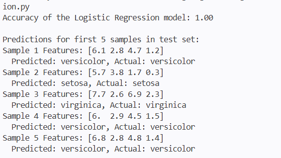

# Logistic Regression Multiclass (Iris Dataset)

This project demonstrates how to train a multiclass Logistic Regression model using the popular [Iris flower dataset](https://scikit-learn.org/stable/auto_examples/datasets/plot_iris_dataset.html) from `scikit-learn`.

## Overview
The Iris dataset contains 150 samples with 4 features each:
1. Sepal Length
2. Sepal Width
3. Petal Length
4. Petal Width

Using these features, the logistic regression model classifies a flower into one of three categories:
1. Setosa
2. Versicolour
3. Virginica

## Prerequisites
To run this project, you will need Python installed along with the following libraries:
- `scikit-learn`
- `matplotlib`

You can install the required packages using pip:
```bash
pip install scikit-learn matplotlib
```

## How to Run

1. Open your terminal (Command Prompt or PowerShell).
2. Navigate to this project directory:
   ```bash
   cd "c:\Users\Aysha\Documents\machine-learning\Logistic Regression Multiclass"
   ```
3. Run the script:
   ```bash
   python iris_logistic_regression.py
   ```

## Output
Running the script will train the model, split the data into training and testing sets, calculate the model's accuracy, and print out predictions for the first 5 samples in the test dataset to compare against their actual classes.


