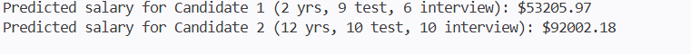

# Multiple Linear Regression - HR Salary Prediction

This project contains the solution for **Lab Task 2**, which involves building a machine learning model using Multiple Linear Regression. 

## Problem Statement
The HR department needs a model to help them decide salaries for future candidates based on three factors:
1. Experience (in years)
2. Written Test Score (out of 10)
3. Personal Interview Score (out of 10)

Given the historical data of previous hires in `hiring.csv`, the task is to predict the salaries for the following candidates:
- **Candidate 1**: 2 years experience, 9 test score, 6 interview score
- **Candidate 2**: 12 years experience, 10 test score, 10 interview score

## Dataset (`hiring.csv`)
The dataset includes the following columns:
* `experience`: Work experience of the candidate (contains missing values and string numbers like 'five', 'two').
* `test_score(out of 10)`: The score from the written test (contains missing values).
* `interview_score(out of 10)`: The score from the personal interview.
* `salary($)`: The target variable, representing the salary of the candidate.

## Preprocessing Steps
Before training the model, the data was cleaned in `solution.py`:
1. **Experience**: Missing values were replaced with `'zero'`. The string representations of numbers (e.g., 'five') were converted to integer values (e.g., 5).
2. **Test Score**: Missing values were filled with the median score of the existing candidates.

## Model
The project uses `scikit-learn` to build a **LinearRegression** model using multiple independent variables (Experience, Test Score, Interview Score) to predict the dependent variable (Salary).

## How to Run

1. Open your terminal or command prompt.
2. Navigate to this directory.
3. Make sure you have the required Python libraries installed:
   ```bash
   pip install pandas scikit-learn numpy
   ```
4. Run the script:
   ```bash
   python solution.py
   ```

## Results
The model predicts the following salaries:
* **Candidate 1** (2 yrs, 9 test, 6 interview): `$53,205.97`
* **Candidate 2** (12 yrs, 10 test, 10 interview): `$92,002.18`


