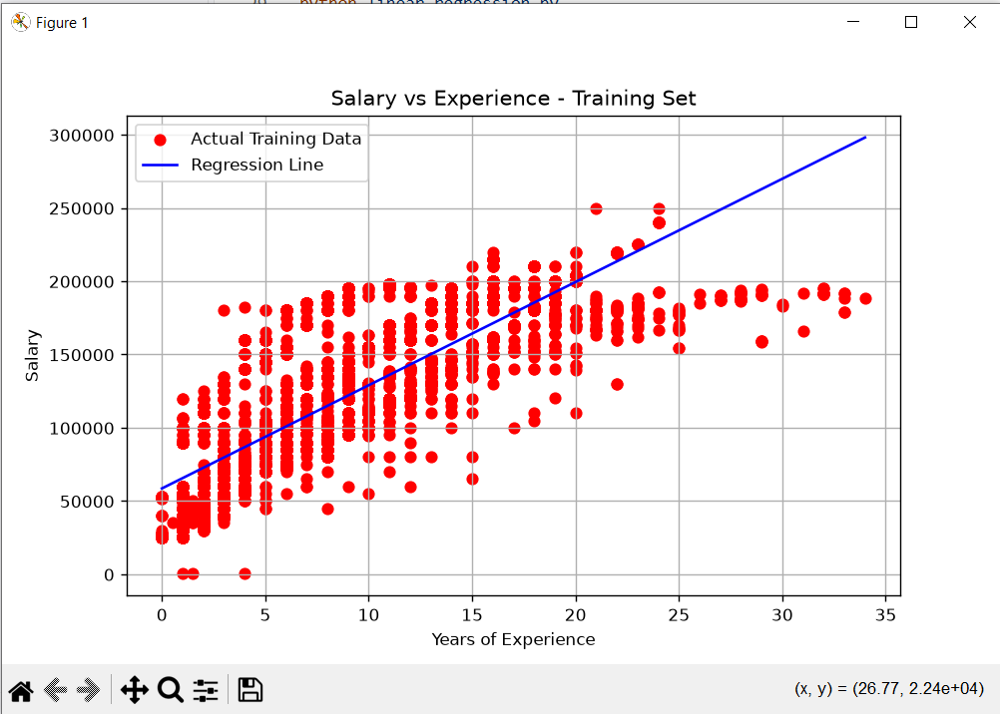

# Salary Linear Regression

A simple linear regression project that predicts salary from years of experience using Python, pandas, NumPy, Matplotlib, and scikit-learn.

## Project Files

- `linear_regression.py` - Loads the data, cleans the selected columns, trains a linear regression model, evaluates it, and displays results.
- `Salary_Data.csv` - Salary dataset used by the script.

## Requirements

- Python 3.9 or later
- pandas
- NumPy
- Matplotlib
- scikit-learn

Install the dependencies with:

```bash
python -m pip install numpy pandas matplotlib scikit-learn
```

## Run the Project

From this directory, run:

```bash
python linear_regression.py
```

The script will:

1. Load and clean the salary dataset.
2. Use `Years of Experience` as the input feature and `Salary` as the target.
3. Split the data into training and test sets.
4. Train a `LinearRegression` model.
5. Print actual and predicted salaries, mean squared error, and the R² score.
6. Display training-set and test-set regression plots.
7. Predict the salary for 12 years of experience.

Keep `Salary_Data.csv` in the same directory as `linear_regression.py` when running the script.

